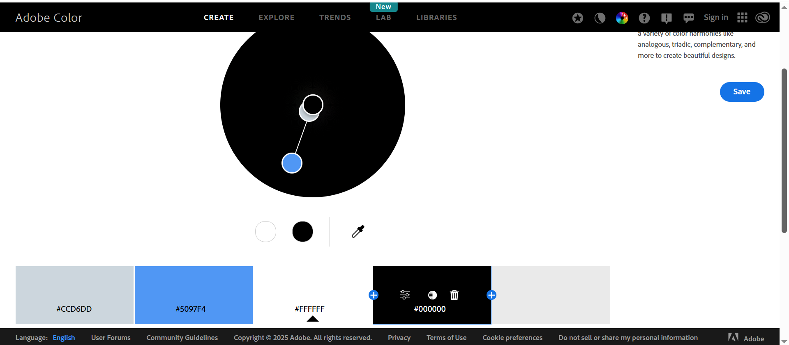

# TAG X
A website that promotes TAG X’s tag rugby business. The site designed to showcase services provided. The website provides a logical flow of information, making it easy for users to navigate through the site. The site contains 'call to action' buttons, giving users the chance to send an enquiry via the enquiry form and navigation to help users move around the site.
TAG X is dedicated to providing a fun, non-contact way of playing rugby. This website serves as a digital platform to promote TAG X services and create an easy point of contact for clients. To view the live site, [click here](https://rory-codes.github.io/tag-x/)

## Table of Content

1. [Project Goals](#project-goals)
    1. [User Goals](#user-goals)
    2. [Site Owner Goals](#site-owner-goals)
2. [User Experience](#user-experience)
    1. [User profiles](#user-profiles)
    2. [User Requrements and Expectations](#user-requrements-and-expectations)
    3. [User Stories](#user-stories)
3. [Design](#design)
    1. [Design Choices](#design-choices)
    2. [Colour](#colours)
    3. [Fonts](#fonts)
    4. [Structure](#structure)
    5. [Wireframes](#wireframes)
4. [Technologies Used](#technologies-used)
    1. [Languages](#languages)
    2. [Frameworks & Tools](#frameworks-&-tools)
5. [Features](#features)
    1.[Overview](#overview)
    2.[Detailed overview](#detailed-overview)
    3.[Features left to implement](#left-to-implement)
6. [Testing](#validation)
    1. [HTML Validation](#HTML-validation)
    2. [CSS Validation](#CSS-validation)
    3. [Accessibility](#accessibility)
    4. [Performance](#performance)
    5. [Reactivity](#reactivity)
    6. [Functionality testing](#functionality)
7. [Bugs](#Bugs)
8. [Deployment](#deployment)
9. [Credits](#credits)
10. [Acknowledgements](#acknowledgements)
 

## Project goals
 To provide a website that showcases TAG X tag rugby and provides its customers with an easy to navigate site. The path follows a logical path through to the enquiry form which adapts depending on the type of booking. Please click [here](https://rory-codes.github.io/rt-coaching/) to see the deployed site.
 
### User goals
**For adult customers: ** 
Provide information on TAG X and the services provided and give customers information on tag rugby and how it is played. Provide images so the user can see other people playing tag rugby. There should also be information on the venues and times provided, as well as the pricing. There will also be an enquiry form so members can enquire about upcoming sessions.
### Site owner goals 
**For TAG X:** 
Build an online presence to attract new clients and give users somewhere to access information on TAG X. Also, open communication with users via the enquiry form.

## User Experience (UX)

### User profiles:
* Adults interested in playing tag rugby. 
* Children interested in playing tag rugby.
* Parents of children interested in playing tag rugby.

### User requirements and expectations
* **Intuitive Navigation:** The site follows a clear menu structure for easy access to different parts of the site.

* **Responsive Design:** The site has been optimised for mobile and desktop usage, allowing users to access content on the go. This has been achieved using a 'mobile first approach' to ensure the content works on mobiles before addressing larger screen sizes.

* **Clear Call-to-Actions:** The website contains booking buttons so that users can easily access the enquiry  form. 

* **Fast Load Times:** Images and resources have been optimised to ensure smooth browsing on all devices, including mobile.

* **Accessibility:** The website follows WCAG 2.1 guidelines to ensure all users can access content easily and without obstacle.

**Further considerations**
1. **Strategy:** Set user needs and goals to ensure the site serves TAG X and its customers/clients.
2. **Scope:** Contain features such as the about, carousel, rules, history, card and enquiry sections.
3. **Structure:** Design a logical easy-to-use structure that produces easy navigation and ease of access for its users.
4. **Skeleton:** Create wireframes to map out the layout the site and give TAG X an idea of what to expect when complete.
5. **Surface:** Develop cohesive bespoke website with responsive design using TAG X colours and branding.

### User stories:
User stories were used to align content with the target audience of the client website. This was broken down into three categories: Must haves, Should haves and Could haves. This helped establish task prioritisation and guide the development of the site.

#### Must haves

##### User story 1:
As a first-time visitor who’s not familiar with Tag-X, I want a visually clear and engaging landing page so that I can instantly understand what the site is about and be encouraged to explore further.

##### User story 2:
As a young person interested in trying a new sport, I want to use the carousel to see images of what Tag-X sessions look like so that I can quickly get a feel for the sport.

##### User story 3:
As a parent looking for sessions for my child, I want to use interactive cards to view venues, times and prices so that I can easily compare and choose a suitable option.
##### User story 4:
As a parent looking for sessions for my child, I want to use interactive cards to view venues, times and prices so that I can easily compare and choose a suitable option.

#### Should haves

##### User story 5:
As a 12-year-old curious about joining, I want to read a simple description of what Tag Rugby is and brief history of how it was established so that I can understand what’s involved before signing up.

##### User story 6:
As a new user, I want the rules of Tag Rugby to be easy to find and understand so that I can quickly learn how the game works.

#### Could haves

#### User story 7:
As a user with eyesight problems, I would like to be able to toggle between light and dark modes when using the site so that I can view the content effectively.

## Design

### Design choices
* **Branding:** A consistent color palette and typography has been used throughout the site. It is the same font and colour palette used in the logo for TAG X representing alignment with TAG X’s identity and brand.

* **Engaging Visuals:** There is sufficient use of images throughout the site to build user interest.

* **Readable Layout:** The website has been produced to have a clean design with easily readable sections to minimise information overload.

* **Minimalist Design:** There is a clear focus on important information with minimal distractions.

***Landing page** The landing page provides an interesting first impression, hopefully enticing the user to find out more about TAG X.

***Interactive site ** The site contains interactive components such as the user can toggle between the visibility of paragraphs in history and rules section.

***Interactive cards** The site has cards which present information to the user depending on which button they click.

***Adaptive enquiry form** The enquiry form will adapt depending on the button pressed to access the enquiry form. Parents name field will not appear on the adult enquiry form and the drop down list will change depending on adult of junior enquiry form.

### Colour
The colour scheme was selected in coordination with the TAG X brand logo. The colouring creates a bespoke feel to the website and creates a warm, professional appearance for users. 

### Fonts
The fonts were selected using google fonts. 
Encode Sans Semi Expanded was selected for all headings due to looking professional and aligning with the TAG X logo. Jetbrains mono was also selected to align with the TAG X logo.
### Structure
The page is structured in a succinct, recognisable, user friendly, and easy to learn format. Upon arriving to the website, the user sees a familiar type of navigation bar with the TAG X logo on the left side and the navigation links to the right. 
The website consists of one page with various sections: 
- Landing page 
- About section
- Carousel
- Rules section
-History section
-Card section.
-Enquiry section.

### Wireframes

#### Landing page

 

  
#### Main site content

 

 

 

 

#### Enquiry form

 

 

 

 

## Technologies 

1. Languages
* HTML5 To build structure and develop the Website.
* CSS3 to customise and style site with CSS in an external file.
*JavaScript to create interactive front-end development. This is also in an external file.

2. Frameworks
**Frontend Framework**
*Bootstrap V5.3 was used for certain elements.
**IDE**
* Visual Studio Code: The website was created and developed using VS Code.
**Host**
* GitHub: Source of the code is hosted on GitHub and deployed using Git Pages.
**External Design**
* Font Awesome: Icons obtained from https://fontawesome.com/
* Favicon.io: Favicon files were customised created at https://favicon.io/favicon-converter/
**Images**
* Squoosh: https://squoosh.com/ was used to reduce the size of the images used throughout the website.
* Balsamiq: Website wireframes were created using balsamiq https://balsamiq.com/wireframes/desktop
***Booking Integration:** Booking enquiry form to allow users to message TAG X about upcoming sessions.
***Deployment:** Hosted via GitHub Pages (https://github.com/rory-codes/tag-x/

## Features

### Overview
* Responsive design and content.
* Hidden internal section (landing page).
* External frameworks used.
* Bootstrap grid system used to align content.
* Imported google fonts, favicon, TAG X logo, font-awesome logo, and map.
* Bootstrap used to add features such as accordion or cards and then customised using CSS or bootstrap classes.
* Booking inquiry form.
* Carousel with images of people playing tag rugby.
* Easy to navigate site design, making it user friendly and accessible.
*Adaptive form.
*Interactive content to provide user feedback.
*Form validation using JavaScript.
