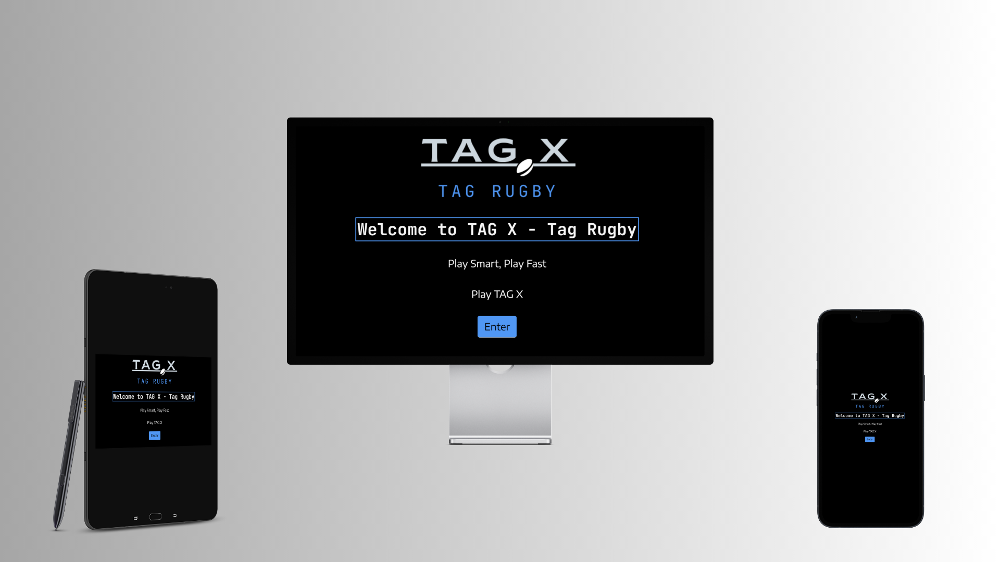
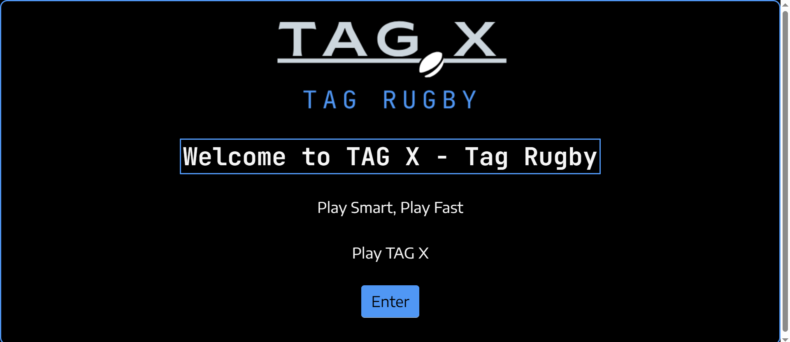
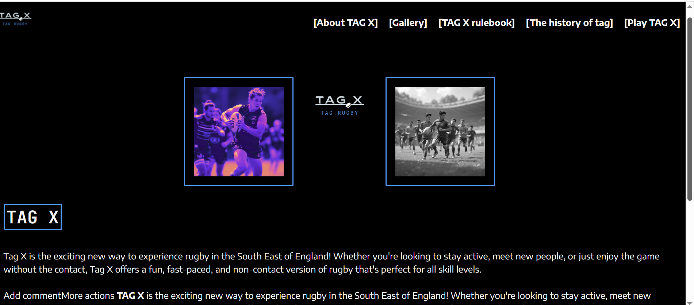
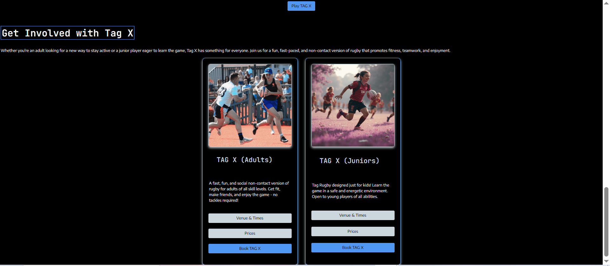
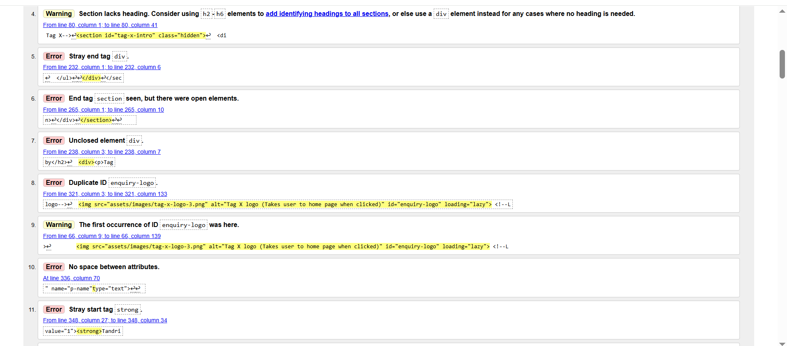
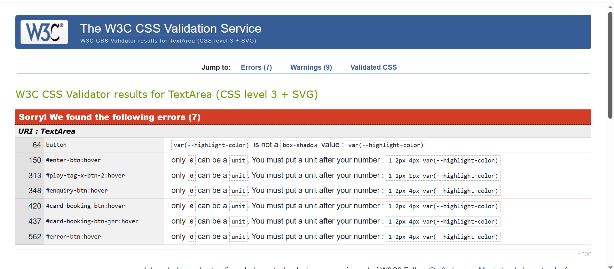
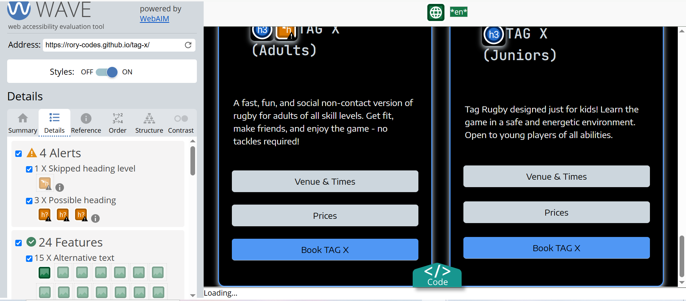
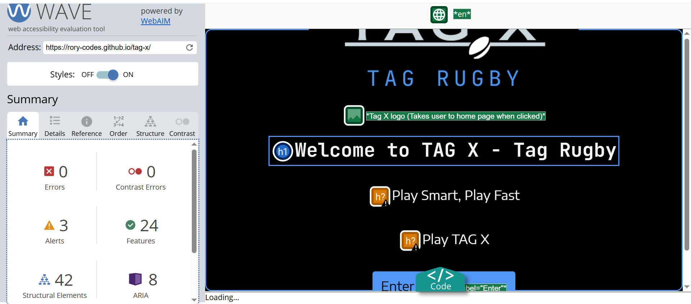

# TAG X
A website that promotes TAG X’s tag rugby business. The site designed to showcase services provided. The website provides a logical flow of information, making it easy for users to navigate through the site. The site contains 'call to action' buttons, giving users the chance to send an enquiry via the enquiry form and navigation to allow users to navigate the site.
TAG X is dedicated to providing a fun, non-contact way of playing rugby. This website serves as a digital platform to promote TAG X services and create an easy point of contact for clients. To view the live site, [click here](https://rory-codes.github.io/tag-x/)

## Table of Content

1. [Project Goals](#project-goals)
    1. [User Goals](#user-goals)
    2. [Site Owner Goals](#site-owner-goals)
2. [User Experience](#user-experience)
    1. [User profiles](#user-profiles)
    2. [User Requrements and Expectations](#user-requrements-and-expectations)
    3. [User Stories](#user-stories)
3. [Design](#design)
    1. [Design Choices](#design-choices)
    2. [Colour](#colours)
    3. [Fonts](#fonts)
    4. [Structure](#structure)
    5. [Wireframes](#wireframes)
4. [Technologies Used](#technologies-used)
    1. [Languages](#languages)
    2. [Frameworks & Tools](#frameworks-&-tools)
5. [Features](#features)
    1.[Overview](#overview)
    2.[Detailed overview](#detailed-overview)
    3.[Features left to implement](#left-to-implement)
6. [Testing](#validation)
    1. [HTML Validation](#HTML-validation)
    2. [CSS Validation](#CSS-validation)
    3. [Accessibility](#accessibility)
    4. [Performance](#performance)
    5. [Automated testing](#automated)
    6. [Functionality testing](#functionality)
7. [Bugs](#Bugs)
8. [Deployment](#deployment)
9. [Credits](#credits)
10. [Acknowledgements](#acknowledgements)
 

## Project goals
 To provide a website that showcases TAG X tag rugby and provides its customers with an easy to navigate site. The path follows a logical path through to the enquiry form which adapts depending on the type of booking. Please click [here](https://rory-codes.github.io/rt-coaching/) to see the deployed site.
 
### User goals
**For adult customers:** 
Provide information on TAG X and the services provided and give customers information on tag rugby and how it is played. Provide images so the user can see other people playing tag rugby. There should also be information on the venues and times provided, as well as the pricing. There will also be an enquiry form so members can enquire about upcoming sessions.

**Junior customers:**
Provide information on tag x and how it can benefit junior customers. Provide information on what tag rugby is and how it is played.

**Parents of junior customers:**
Provide information on venue/times and pricing. 
### Site owner goals 
**For TAG X:** 
Build an online presence to attract new clients and give users somewhere to access information on TAG X. Also, open communication with users via the enquiry form.

## User Experience (UX)

### User profiles:
* Adults interested in playing tag rugby. 
* Children interested in playing tag rugby.
* Parents of children interested in playing tag rugby.

### User requirements and expectations
* **Intuitive Navigation:** The site follows a clear menu structure for easy access to different parts of the site.

* **Responsive Design:** The site has been optimised for mobile and desktop usage, allowing users to access content on the go. This has been achieved using a 'mobile first approach' to ensure the content works on mobiles before addressing larger screen sizes.

* **Clear Call-to-Actions:** The website contains booking buttons so that users can easily access the enquiry  form. 

* **Fast Load Times:** Images and resources have been optimised to ensure smooth browsing on all devices, including mobile.

* **Accessibility:** The website follows WCAG 2.1 guidelines to ensure all users can access content easily and without obstacle.

* **Interactive front-end:** The website has various interactive front-end elements which were achieved using javaScript.

**Further considerations**
1. **Strategy:** Set user needs and goals to ensure the site serves TAG X and its customers/clients.
2. **Scope:** Contain features such as the about, carousel, rules, history, card and enquiry sections.
3. **Structure:** Design a logical easy-to-use structure that produces easy navigation and ease of access for its users.
4. **Skeleton:** Create wireframes to map out the layout the site and give TAG X an idea of what to expect when complete.
5. **Surface:** Develop cohesive bespoke website with responsive design using TAG X colours and branding.

### User stories:
User stories were used to align content with the target audience of the client website. This was broken down into three categories: Must haves, Should haves and Could haves. This helped establish task prioritisation and guide the development of the site.

#### Must haves

##### User story 1:
As a first-time visitor who’s not familiar with Tag-X, I want a visually clear and engaging landing page so that I can instantly understand what the site is about and be encouraged to explore further.

##### User story 2:
As a young person interested in trying a new sport, I want to use the carousel to see images of what Tag-X sessions look like so that I can quickly get a feel for the sport.

##### User story 3:
As a parent looking for sessions for my child, I want to use interactive cards to view venues, times and prices so that I can easily compare and choose a suitable option.

##### User story 4:
As a parent looking for sessions for my child, I want to use interactive cards to view venues, times and prices so that I can easily compare and choose a suitable option.

#### Should haves

##### User story 5:
As a 12-year-old curious about joining, I want to read a simple description of what Tag Rugby is and brief history of how it was established so that I can understand what’s involved before signing up.

##### User story 6:
As a new user, I want the rules of Tag Rugby to be easy to find and understand so that I can quickly learn how the game works.

#### Could haves

#### User story 7:
As a user with eyesight problems, I would like to be able to toggle between light and dark modes when using the site so that I can view the content effectively.

## Design

### Design choices
* **Branding:** A consistent color palette and typography has been used throughout the site. It is the same font and colour palette used in the logo for TAG X representing alignment with TAG X’s identity and brand.

* **Engaging Visuals:** There is sufficient use of images throughout the site to build user interest.

* **Readable Layout:** The website has been produced to have a clean design with easily readable sections to minimise information overload.

* **Minimalist Design:** There is a clear focus on important information with minimal distractions.

* **Landing page** The landing page provides an interesting first impression, hopefully enticing the user to find out more about TAG X.

### Colour
The colour scheme was selected in coordination with the TAG X brand logo. The colouring creates a bespoke feel to the website and creates a warm, professional appearance for users. 

### Fonts
The fonts were selected using google fonts. 
Encode Sans Semi Expanded was selected for all headings due to looking professional and aligning with the TAG X logo. Jetbrains mono was also selected to align with the TAG X logo.

### Structure
The page is structured in a succinct, recognisable, user friendly, and easy to learn format. Upon arriving to the website, the user sees a familiar type of navigation bar with the TAG X logo on the left side and the navigation links to the right. 

The website consists of one page with various sections: 
- Landing page 
- About section
- Carousel
- Rules section
- History section
- Card section.
- Enquiry section.

### Wireframes

#### Landing page

 

  
#### Main site content

 

 

 

 

#### Enquiry form

 

 

 

 

## Technologies 

1. Languages
* HTML5 To build structure and develop the Website.
* CSS3 to customise and style site with CSS in an external file.
*JavaScript to create interactive front-end development. This is also in an external file.

2. Frameworks
**Frontend Framework**
*Bootstrap V5.3 was used for certain elements.
**IDE**
* Visual Studio Code: The website was created and developed using VS Code.
**Host**
* GitHub: Source of the code is hosted on GitHub and deployed using Git Pages.
**External Design**
* Font Awesome: Icons obtained from https://fontawesome.com/
* Favicon.io: Favicon files were customised created at https://favicon.io/favicon-converter/
**Images**
* Squoosh: https://squoosh.com/ was used to reduce the size of the images used throughout the website.
* Balsamiq: Website wireframes were created using balsamiq https://balsamiq.com/wireframes/desktop
***Deployment:** Hosted via GitHub Pages (https://github.com/rory-codes/tag-x/

## Features

### Overview
* Responsive design and content.
* Hidden internal section (landing page).
* External frameworks used.
* Bootstrap grid system used to align content.
* Imported google fonts, favicon, TAG X logo, font-awesome logo, and map.
* Booking inquiry form.
* Carousel with images of people playing tag rugby.
* Easy to navigate site design, making it user friendly and accessible.
*Adaptive form.
*Interactive content to provide user feedback.
*Form validation using JavaScript.
*The site contains interactive components such as the user can toggle between the visibility of paragraphs in history and rules section.
*The site has cards which present information to the user depending on which button they click.
*The enquiry form will adapt depending on the button pressed to access the enquiry form. Parents name field will not appear on the adult enquiry form and the drop down list will change depending on adult of junior enquiry form.

### Detailed overview of features 

#### Site wide 
**Favicon**
* The site incorporates a custom favicon so that users can identify the site tab on their browser.
* This uses the same font and colours as the logo and website to start building brand familiarity.

#### Landing Page 

*  Large Logo: Prominent display of the **TAG X** branding, helping reinforce identity.
*  Slogan / Subtitle: "Play smart, play fast, play TAG X" positioned under the logo to immediately convey the company slogan.
* Enter Button: “Enter” button added to direct users to the main content and subsequently hide the landing page.

#### About section

*  Image - Logo - Image layout: A central logo flanked by two tag rugby images to create visual balance on larger screens. This should be one on top of each other on mobiles.
*  Introductory Text: A friendly explanation of what Tag X offers — emphasising non-contact fun, inclusivity, and player safety.
*  Dual Paragraph Layout: One for a general description and another for how the sport works (e.g., 6- and 7-a-side, no tackling).
* User navigation: User can navigate directly to “Play TAG X “or “Find out more about TAG X”. depending on the selection, the user will be directed through the site differently due to some sections being “hidden” initially.

#### Carousel 

* Rotating or swipeable images of real sessions (tag rugby in action).
* Emphasizes fun, safety, and teamwork visually.
* Webp format used for images to improve performance. Lady loading also used to help with performance.
*Autoscroll so the user is shown all of the images without having to press anything.
* HTML, CSS and javascript used for structure, styling and interactivity.

#### Rules section

*Tag rugby description section tells users what tag rugby is, how it differs from contact rugby and why it’s suitable for all ages/abilities.
*Headings that are clickable and allow the user to toggle the visibility of the correlating paragraph when clicked.
*Paragraph text colour changes when the user hovers over the text. 
* Covers gameplay rules, team sizes, scoring, penalties. Giving users information on the sport of tag rugby.

#### History section

* Headings that are clickable and allow the user to toggle the visibility of the correlating paragraph when clicked.
* Paragraph text colour changes when the user hovers over the text. 
* Button that takes users to the card section, taking users through the site towards the enquiry form.
* HTML, CSS and JavaScript used for structure, styling and interactivity.

#### Card section

* Two cards introduced. One for adults and one for juniors.
* HTML, CSS and JavaScript used for structure, styling and interactivity.
* Images used with filters applied to add visual styling to the card.
* Both cards have a venue and times button which allows users to see information on times and venue of sessions. Information is displayed at the bottom of the card when the button is clicked. This is achieved using JavaScript.
*Both cards also have a pricing button which allows users to see information on the pricing for TAG X lessons. This information is also displayed at the bottom of the card when the button is clicked.
*There is also a ‘Book TAG X’ button which transports users to the enquiry form and adapts the content depending on whether the junior or adult ‘book TAG X’ button was clicked.

#### Enquiry form

* The enquiry form contains a heading, paragraph and a form.
* The enquiry form contains a logo.
* The form contains the following entries (Entries with a * are required): First name*, Last name*, parent name, email*, phone number*, message, type of service (drop down menu)*, and a submit button.
* CSS styling used to align with previous content and brand identity. 
* JavaScript was used for form validation to ensure that user input is sufficient and accurate.
* Depending on the button used to access the form, the form will adapt. Parent name will only appear for junior bookings and the drop-down menu will change depending on whether it is an adult or junior booking.

#### Features Left to Implement
* User story: As a potential new customer with eyesight problems, I would like to be able to toggle between light and dark modes when using the site so that I can view the content effectively.

## Testing

### HTML validation
The website's HTML was checked using the W3C Markup Validation Service. Every page loads without any issues or warnings.

**HTML validation - Pre fixes**
#### Main

**HTML validation - Post fixes**
#### Main

### CSS validation
To validate the website's CSS, the W3C Jigsaw CSS Validation Service was utilized. 
When the entire page is validated, the validator displays a few issues related to Bootstrap v5.0. My own custom CSS passes validation with no mistakes identified, although there are some cautions about using root variables.

**Prefix CSS validation:**
The following errors were found.

**Post fix CSS validation:**
No errors were found.

### Accessibility 
To make sure the website complied with strict accessibility guidelines, the WAVE WebAIM web accessibility assessment tool was utilized. Every page passes with no mistakes.
**Prefix**

**Postfix**
  
 
### Performance
** Lighthouse Testing Before Fixes**

#### Main (index.html)

**Lighthouse Testing After Fixes**

#### Main (index.html)

#### JS Lint 

**Testing protocol:**
1. Go to [TAG X](https://rory-codes.github.io/tag-x/index.html) in an open browser.
2. Right-click and select "Inspect" to open the developer tools.
3. Reduce to 320px and set to responsive.
5. To adjust the responsive window's minimum and maximum width, click and drag it back and forth.

**Anticipated:**
No graphics are stretched, and the website works well on all screen widths.
There isn't a horizontal scroll.
Nothing overlaps.

**Actual:**
The website behaved as expected apart from the following issues:
* The logo in the landing page is too big on mobile
* Enquiry form logo also not working correctly on all devices.
* About section images and logo are not aligned correctly on tablet.

This was tested manually on the following devices:
* Iphone 12
* Iphone XR
* Samsung galaxy S24.
* LG Thinkpad laptop.
* Ipad pro.
* Devtools various phones: Iphone SE, Iphone XR, Iphone 12 pro, Iphone 14 pro max, pixel 7, Samsung galaxy s8+, Samsung galaxy S20 ultra, Iphone 5/SE.

### Automated testing
The site initially used JEST as a form of automated testing. However, ran into issues and decided that the site would only use manual testing during its development.

### Functionality testing

 **Navigation**
 To ensure that all navigation links lead to the appropriate pages and sections, testing was done.  To accomplish this, each page's navigation links were clicked.

| Page to Load       |          Link          |  Outcome
| ------------------ | ----------------------- | ------------------------------------------------------------- |
| Home               | index.html              | Worked as expected                                            |
| About TAG X        | index.html#tag-x-intro  | Worked as expected                                            |
| Gallery            | index.html#carousel     | Worked as expected                                            |
| TAG X Rulebook     | index.html#rules        | Worked as expected                                            |
| The history of tag | index.html#history      | Worked as expected                                            |
| Play TAG X         | index.html#tag-x-adults | Worked as expected                                            |

 **Form Testing**
The form on the home page was tested to ensure it functioned as intended when the correct data type was input and required fields were entered/selected.

**Scenario One - Correct Inputs**
Steps to test:
Navigate to the about section.
Click on ‘Play TAG X’ link in the about section.
Click on card one
User will be redirected to the adult enquiry page and then input the following:
First Name: Rory
Last Name: McThompson
Email: email@test.com
Phone number: 07486728393
Selection any selection in session drop-down.
Message: This is a test.
Click Submit
User should get a notification that the form was submitted successfully and scroll up function brings user to the about section.

**Expected:**
Form submitted without any errors, and the user receives a message and is scrolled to the about section.

**Actual:**
There were no errors present, and the user receives a message and is scrolled to the about section.

Navigate to the about section.
Click on ‘Play TAG X’ link in the about section.
Click on card two
User will be redirected to the junior enquiry page and then input the following:
Full Name: Rory McThompson
Parents name: Jane McThompson
Contact number: 07486728393
Email address: email@test.com
Selection any selection in session drop-down.
Message: This is a test.
Click Submit
User should get a notification that the form was submitted successfully and scroll up function brings user to the about section.

**Expected:**
Form submitted without any errors, and the user receives a message and is scrolled to the about section.

**Actual:**
There were no errors present, and the user receives a message and is scrolled to the about section.

**Scenario two - required field not entered**
Steps to test:

Navigate to the about section.
Click on ‘Play TAG X’ link in the about section.
Click on card two
User will be redirected to the junior enquiry page and then input the following:
Full Name: Rory McThompson
Parents name: Jane McThompson
Contact number: 07486728393
Email address: email@test.com
Selection any selection in session drop-down.
Message: This is a test.
Click Submit
User should be prompted to enter a first name. 
Next- repeat step for all required fields: First name, Last name, Email address, Phone number, selection on both drop down menus.

**Expected:**

User is prompted to enter the missing required field

**Actual:**

The user is prompted to enter the missing required field and this is the same for all required fields.

**Scenario three - Email address incorrect format**
Steps to test:

Navigate to the about section.
Click on ‘Play TAG X’ link in the about section.
Click on card two
User will be redirected to the junior enquiry page and then input the following:
Full Name: Rory McThompson
Parents name: Jane McThompson
Contact number: 07486728393
Email address: emailtest.com
Selection any selection in session drop-down.
Message: This is a test.
Click Submit
Repeat with a different entry missing.

**Expected:**
User should be prompted to enter an email address with the correct format. For other entries, the same applies with the user being prompted to enter a valid entry.

**Actual:**

The user is prompted to enter an email address with the correct format/alternative entry with the correct format. Once that is complete, form submits as expected.

**Landing button**
**Expected:**
* The landing page should be hidden (fade away) and the main content is displayed (fade in).

**Actual**
* The landing page should be hidden (fade away) and the main content is displayed (fade in).

**About buttons**
**Expected:** 
* User clicks ‘learn more about the world of tag’ button and the carousel, rules and history section are unhidden, and the user is scrolled down to the carousel.
* User clicks the ‘Play TAG X’ button and this unhides the cards and scrolls the user down to the card.

**Actual:**
* Both buttons behaved as expected.

**History button**
**Expected:**
* Scrolls the user down to the cards.

**Actual:**
* Behaved as expected.

**Card buttons**
**Expected:**
* Click adult venue/time button and expect to see the adult venue and times.
* Click the adult pricing button and expect to see the adult pricing
* Click the adult book now button and the user should be taken to the enquiry form, containing the correct form items.
* Click junior venue/time button and expect to see the junior venue and times.
* Click the junior pricing button and expect to see the junior pricing
* Click the junior book now button and the user should be taken to the enquiry form, containing the correct form items.
 
**Actual:**
All links performed as expected. 

## Bugs
Several issues/bugs were present during the web development process. Below is a list of issues which are broken down into problem and fix, highlighting how code was changed to resolve issues.

### Issue #1: Form submission
- **Problem**: Cards are not aligned.
- **Fix**: Added a margin to the text within the card.

### Issue #2: Navbar not accessible on mobile devices.
- **Problem**: Navbar items going black as the user hovers over them, creating a bad UX.
- **Fix**: There was a conflicting bootstrap class, which was removed, identified using devtools.

### Issue #3: Large Images with png file type Affecting Loading Time: 
-**Problem**: Image files containing too much data were taking longer to load the webpage and driving down performance.
-**Fix**: I used squoosh to compress certain image files from "png" to "webp.". Dramatically improving performance. Applied ‘loading=”lazy” to certain images to optimise performance as well.

### Issue #4: Logo alignment on landing page and enquiry form.
- **Problem**: On smaller screens alignment is out.
- **Fix**: Used CSS to address this and added flex classes to ensure the site works on all devices.

### Issue #5: Alignment issues with about section on tablet
- **Problem**: The images and logo come out of line and it looks messy and unappealing on tablet.
- **Fix**: 2 media queries were introduced on screen about 820px to address this issue.
 
### Issue #6: Form asking for venue/time even when it was in there.
- **Problem**: Form asking for venue/time even when it was in there and never submitting.
- **Fix**: Had to adjust the javaScript to not require fields that are hidden, due to the confusion of having some fields showing for adults and some fields showing for juniors.
  
### Issue #7: ‘play TAG X’ button on navbar.
- **Problem**: When ‘play TAG X’ button on navbar is clicked the form is unhidden and the form is not adapting as expected. This is due to the cards and enquiry form being wrapped in a section called ‘get-involved’. It will require the javaScript being adjusted throughout the site.
- **Fix**: Changed the ID to naviagte to #tag-x-adults instead of #get-involved, which was a wrapper for the other two sections.

### issue #8: Email entry on form not validating correctly. 
- **Problem**: Form not working as expected. There was an issue with the email form entry, it was submitting without the @ sign.
- **Fix**: There was an issue with the javaSrcipt used. The fix involved ammending the javaScript.

## Deployment

### Deployment to Github Pages
The portfolio website deployed using GitHub Pages

**Steps to Deploy site:**
* Sync files to a GitHub repository from VS-Code.
* Go to the Settings tab in the repository.
* Scroll down to the Pages section.
* Under Branch, select main
* Click Save. Live link can be found ![here] (https://rory-codes.github.io/tag-x/)

## Credits
* Bootstrap - This website's code was utilised to construct the navbar and cards' structural foundation according to my pertinent preferences and guarantee that the site's styling is consistent throughout. Additionally, bootstrap was helpful with alignment issues. 
* JavaScript - JavaScript should also be commended because it was utilized to create most of the functional behaviour of the site.
* Jquery - Jquery libraries were pivotal in the building of the site.
* Git - Git pages were used for project planning, hosting repositories.
* VS-code - Virtual studio code (VS-code) was used for all coding.
* Squoosh - Squoosh was used to compress files, changing them from PNG to WebP, which shortened the time the website took to load.
* Code Institute - Resources from the Code Institute, such as my tutor Mo Shami, who gave advice on how approach the project.
 Code institute also helped me learn about important principles such as: javaScript and JQuery, jest and some Python. Adding to previous learning
*Wendy Purdy - Wendy has been helpful with her commitment and help towards my development.
* W3schools - Used to refer to previously learned principles, such as javaScript and Jquery. This was helpful when building the site.
* Slack - To discuss code, resolve hosting and connectivity problems, and get input on written code.
* Stackoverflow - This was used various times throughout the process to quickly look up something and make mental connections. 
* Chome developer tools - The 'preload' and 'preconnect' scripts used on this website were read, found, and learned by Chrome developers. Chrome DevTools is a lighthouse tool for testing and examining the accessibility and performance of code.
* Favicon.io - This was used to create favicons.
* Google fonts - Used to import fonts.
* Canva.com - Used to create Logo for RT Coaching.
* Font awesome - Used to import icons.
* Balsamic - Used to create wireframes.
* color.adobe.com - Used to create palette for TAG X and subsequently used throughout site.

### Media 
*  Used to create AI generated images (Copyright free).

## Acknowledgements
Thank you! This is my second project via the code institute - Full stack web development (level 5) diploma. Thanks to my mentor, code institute and Wendy Purdy for supporting me during this milestone project.
